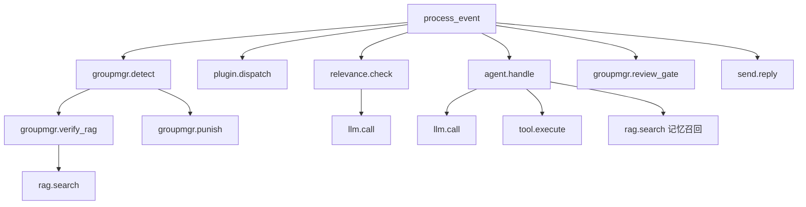
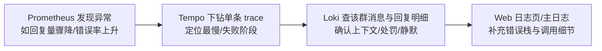

# 可观测性（Observability）

JuanNiang-Neo 的可观测性由**四条独立通道**组成，各司其职、互不污染：

| 通道 | 数据源 | 存储 | 用途 |
|---|---|---|---|
| 指标 Metrics | `GET /metrics`（Prometheus 文本） | Prometheus | 吞吐/延迟/错误/成本的**趋势与告警** |
| 主日志 Logs | `internal/logging`（stdio + Web Hub） | stdout/journald + Web 面板 | 运行期事件、排障上下文 |
| 统计事件 Stats | `internal/agent/stats`（独立 NDJSON 文件） | Loki + Promtail | **每群消息/回复明细统计**（独立于主日志 pipeline） |
| 链路追踪 Traces | OpenTelemetry OTLP | Grafana Tempo | 单条消息处理的全流程瀑布图 |

```mermaid
graph TD
    subgraph 机器人[JuanNiang-Neo]
        A[事件循环] -->|指标| M[/metrics]
        A -->|主日志| L1[internal/logging<br/>stdio + Web Hub]
        A -->|统计事件| S[stats 写入器<br/>NDJSON + lumberjack 轮转]
        A -->|span| T[OTLP Exporter]
    end

    M --> P[Prometheus]
    L1 --> J[stdout / journald<br/>Web 面板日志页]
    S --> F[data/stats/chat-events*.log]
    F -->|promtail 独立 job| K[Loki]
    T -->|OTLP HTTP| TM[Tempo]

    P --> G[Grafana]
    K --> G
    TM --> G
```

> 详细部署步骤（docker compose / systemd / 反代）见 [deployment.md](deployment.md)；本文聚焦**各通道怎么看、怎么查、怎么联合排障**。

---

## 1. 部署与数据源

`deployments/docker-compose.yaml` 一键启动全部可观测性组件（与业务栈同网络）：

```bash
docker compose -f deployments/docker-compose.yaml up -d --build
```

| 组件 | 服务名 | 端口 | Grafana 数据源地址（容器网络内） |
|---|---|---|---|
| 可视化 | `grafana` | 3000 | —（默认 admin/admin，首次登录建议改密） |
| 指标 | Prometheus（需自建或复用现有） | 9090 | `http://prometheus:9090` |
| 日志统计 | `loki` | 3100 | `http://loki:3100` |
| 日志采集 | `promtail` | — | 自动采集 `data/stats/chat-events*.log` |
| 追踪 | `tempo` | 3200 / 4318 | `http://tempo:3200` |

- 机器人 `/metrics` 与 OTLP 上报**无需额外配置**（OTLP 默认指向 `http://tempo:4318`，见 compose 环境变量）。
- 统计通道默认开启（`STATS_ENABLED=true`）；关闭则不写盘，机器人主流程不受影响。
- Grafana 已内置 **provisioning**（`deployments/grafana/chat-stats/provisioning/`）：自动注册 Loki/Tempo 数据源，并自动加载 3 个面板到「JuanNiang-Neo」文件夹：
  - `群聊天消息统计`（`deployments/grafana/chat-stats/dashboards/chat-stats.json`）——Loki 聊天明细与统计，顶部可选群过滤
  - `卷娘 JuanNiang 监控`（`deployments/grafana/juanniang-dashboard.json`）——Prometheus 综合监控（45 面板）
  - `JuanNiang-Neo 链路追踪`（`deployments/grafana/juan-niang-traces.json`）——Tempo TraceQL 面板
  - 登录后左侧 Dashboards → JuanNiang-Neo 即可查看；聊天面板顶部可选群过滤。
- 各组件数据保留：Prometheus 由自建实例决定；Loki 7 天（`retention_period: 168h`）；Tempo 本地磁盘（无期限，按需清理）。

---

## 2. 指标（Prometheus）

### 端点与采集

`GET /metrics`（与 `/health` 同级，**无 JWT**），`juanniang_` 前缀：

```yaml
# prometheus.yml
scrape_configs:
  - job_name: juanniang-neo
    scrape_interval: 15s
    static_configs:
      - targets: ['127.0.0.1:8090']
    metrics_path: /metrics
```

> ⚠️ `/metrics` 无鉴权，公网暴露时请在部署层限制来源 IP。

### 指标清单

| 指标 | 标签 | 说明 |
|---|---|---|
| `juanniang_events_total` | `post_type` | 事件吞吐（message/notice/request/cronjob/webhook） |
| `juanniang_messages_total` | `message_type` | 群/私聊消息数 |
| `juanniang_message_dedup_dropped_total` | — | 幂等去重丢弃（WS 重连重复推送） |
| `juanniang_message_blocked_total` | `reason` | 黑名单拦截 |
| `juanniang_message_dropped_total` | `reason` | 相关性/静默/刷屏丢弃 |
| `juanniang_chat_replies_total` | `message_type` | Agent 回复发送数（全局趋势；**每群细分走 Loki**） |
| `juanniang_chat_stats_dropped_total` | `direction` | 统计事件丢弃（Loki 通道队列满/写失败） |
| `juanniang_agent_loops_total` | `outcome` | ReAct 循环结果（ok/error/timeout） |
| `juanniang_agent_loop_duration_seconds` | — | 循环耗时直方图（1s~300s 长尾桶） |
| `juanniang_agent_concurrency_waits_total` | `result` | 全局并发令牌等待（acquired/timeout） |
| `juanniang_agent_concurrency_wait_seconds` | — | 令牌等待耗时 |
| `juanniang_llm_requests_total` | `provider,result` | LLM 调用与错误 |
| `juanniang_llm_tokens_total` | `phase` | Token 消耗（agent/review/relevance） |
| `juanniang_llm_latency_seconds` | — | LLM 延迟直方图 |
| `juanniang_groupmgr_violations_total` | `category,action` | 群管理三级惩罚（warn/mute/kick） |
| `juanniang_groupmgr_detections_total` | `path,verdict` | 违禁判定流水（rag/keyword × punish/review/pass） |
| `juanniang_groupmgr_rag_score` | — | RAG 语义核实分数分布（调阈值依据） |
| `juanniang_groupmgr_llm_reviews_total` | `verdict` | LLM 审核结果（black/white/none/error） |
| `juanniang_groupmgr_spam_total` | `kind` | 图片刷屏 / +1 复读 |
| `juanniang_rag_search_latency_seconds` / `juanniang_rag_search_errors_total` | — | RAG 检索延迟与降级失败 |
| `juanniang_plugin_hook_errors_total` / `juanniang_plugin_hook_duration_seconds` | `plugin,hook` | 插件钩子错误与耗时 |
| `juanniang_http_requests_total` / `juanniang_http_request_duration_seconds` | — | API 请求（路由模板化 path） |
| `juanniang_inventory{resource=...}` | — | 业务库存（知识/记忆/会话/ChatArea/CronJob 等，60s TTL 缓存） |
| `juanniang_external_health{service=...}` | — | rag/t2i/sandbox/redis 健康（未配置不输出） |
| `go_*` / `process_*` | — | Go 运行时（goroutine/内存/GC）与进程指标 |

**设计约束**：全部标签均为低基数（**不使用群号/QQ 号等高基数标签**）；按群/按用户的细分统计请走 Loki 统计通道；Gauge 在 scrape 时实时读取（DB 类数据带 TTL 缓存，scrape 不打库）。

### 建议面板

1. **消息吞吐**：`sum(rate(juanniang_messages_total[5m]))`，叠加 dedup/blocked/dropped 丢弃率
2. **Agent 健康**：`juanniang_agent_loops_active`、循环耗时 P95（`histogram_quantile(0.95, ...)`）、`outcome="error|timeout"` 速率
3. **LLM 成本**：`sum(rate(juanniang_llm_tokens_total[1h])) by (phase)` + 错误率 `juanniang_llm_requests_total{result="error"}`
4. **群管理**：处罚速率、RAG 直罚占比（`detections_total{verdict="punish",path="rag"}` / 总量）、`juanniang_groupmgr_rag_score` 分布
5. **统计通道健康**：`juanniang_chat_stats_dropped_total` 应恒为 0（>0 说明 Loki 通道积压，见 §5 排障）
6. **外部服务矩阵**：`juanniang_external_health`（0/1）
7. **运行时**：`go_goroutines` 趋势（泄漏）、`go_memstats_heap_alloc_bytes`

---

## 3. 主日志（stdio + Web Hub）

- 走 `internal/logging`（彩色 stdout + WARN 以上调用栈），同时推送到 `logging.Default` Hub（环形 250 条 + SSE）。
- 查看方式：Web 面板「日志」页（`GET /api/v1/logs` / `GET /api/v1/logs/stream`）、`docker logs -f juan-niang-neo`、`journalctl -u juan-niang-neo -f`。
- **主日志不进入 Loki**：其格式为人类可读 kv（带 ANSI 颜色），且量大；Loki 只承载统计事件通道（§4）。

---

## 4. 统计事件（Loki + Promtail）

### 事件结构（NDJSON 每行一条）

```json
{"ts":"2026-08-27T12:00:00.000Z","group_id":123456,"user_id":789,"message_id":42,"direction":"msg","text":"早上好"}
{"ts":"...","group_id":123456,"user_id":789,"message_id":42,"direction":"reply","source":"agent","text":"你好呀～","reply_to":"早上好"}
{"ts":"...","group_id":123456,"user_id":789,"message_id":42,"direction":"reply","source":"groupmgr","text":"打广告先交广告费！...","reply_to":"广告内容"}
```

| 字段 | 说明 |
|---|---|
| `direction` | `msg`（群消息）/ `reply`（机器人输出） |
| `source` | 回复来源：`agent`（Agent 回复）/ `groupmgr`（群管理处罚/刷屏/复读警告） |
| `reply_to` | reply 事件携带的**触发消息原文**（消息→回复对应关系） |
| `group_id` / `user_id` / `message_id` | 归属与关联 |

### 埋点位置

| 事件 | 代码位置 |
|---|---|
| 群消息 | `internal/agent/event.go` `processEvent`（Phase 0 幂等去重后） |
| Agent 回复 | `internal/agent/event.go` `sendReply` |
| 群管理处罚/刷屏/复读回复 | `internal/agent/groupmgr` `replyGroup` / `replyGroupImage` / `checkCopySpam` |

### 采集链路

```
事件 → stats.Writer（异步队列，不阻塞主循环）
     → NDJSON 追加 data/stats/chat-events.log（lumberjack：100MB 轮转 + 10 份 + gzip）
     → promtail 独立 job（__path__: chat-events*.log，inode 跟随轮转）
     → Loki（保留 7 天）
```

- 队列满/写失败仅丢弃并计数（`juanniang_chat_stats_dropped_total`），**绝不阻塞消息处理**。
- Promtail 配置样例：`deployments/promtail-chat-stats.yaml`。

### LogQL 查询

```logql
# 每群消息/回复数
sum by (group_id, direction) (count_over_time({job="juanniang"}[1h]))

# 每群按来源统计机器人输出
sum by (group_id, source) (count_over_time({job="juanniang", direction="reply"}[1h]))

# 某群最近消息与对应回复（agent 回复含 reply_to 触发原文）
{job="juanniang", group_id="123456", direction="reply", source="agent"} | json | line_format "{{.text}}  <-  {{.reply_to}}"

# 群管理处罚警告
{job="juanniang", source="groupmgr"} | json | line_format "{{.ts}} {{.text}}"
```

> label 只保留低基数（`group_id`/`direction`/`source`）；`user_id` 与文本在 JSON 字段内，用 `| json` 后过滤，**勿做 label**。

---

## 5. 链路追踪（Grafana Tempo）

- 每条事件 = 一个 trace（根 span `process_event`），下游各阶段均为子 span。
- 上报：OTLP HTTP → `http://tempo:4318`；环境变量控制采样率（`OTEL_TRACE_SAMPLE_RATIO`）与内容捕获（`OTEL_TRACE_CAPTURE_CONTENT`）。

### span 结构（瀑布图层级）



### 查询

1. Explore → **Tempo**，按 `service.name=juan-niang-neo` + 时间范围搜索。
2. 精确定位：`process_event.group_id="123456"` / `process_event.message_content`（截断 100 字符，**精确匹配**）。
3. 排障习惯：找到一条消息 → 看 `agent.handle` 总耗时 → 逐段下钻（`llm.call` 长 = 模型慢；`tool.execute` 长 = 工具慢；`status=error` 直接看失败原因）。

> Tempo 属性搜索是精确值匹配；模糊内容检索用 Loki（§4）或 Web 面板日志页。

---

## 6. 联合排障工作流

三个数据源配合定位问题的典型流程：



**常见场景对照**：

| 症状 | 先看 | 再看 |
|---|---|---|
| 某个群机器人不回复 | Loki：`sum by (group_id)` 该群近期 reply 数 | Prometheus：`juanniang_message_dropped_total{reason="silenced"}`；Tempo：该群最后一条消息 trace |
| 整体回复变慢 | Prometheus：`juanniang_llm_latency_seconds` P95 | Tempo：`llm.call` 耗时分布；检查 Provider 限流 |
| LLM 报错率上升 | Prometheus：`juanniang_llm_requests_total{result="error"}` | Tempo：`status=error` 的 `llm.call` span |
| 群管理处罚异常 | Prometheus：`juanniang_groupmgr_detections_total` 各 path 占比 | Loki：`{job="juanniang", source="groupmgr"}` 处罚话术明细 |
| 统计通道丢数据 | Prometheus：`juanniang_chat_stats_dropped_total` > 0 | 检查 stats 文件是否可写、promtail 是否存活、Loki 是否可达 |

---

## 7. 告警建议（示例）

```yaml
# Prometheus alerting rules（片段）
groups:
  - name: juanniang-neo
    rules:
      - alert: 机器人回复异常
        expr: sum(rate(juanniang_chat_replies_total[10m])) == 0
        for: 10m
        annotations: { summary: "10 分钟内无任何 Agent 回复" }
      - alert: 统计通道积压
        expr: increase(juanniang_chat_stats_dropped_total[10m]) > 0
        annotations: { summary: "群统计事件被丢弃（Loki 通道异常）" }
      - alert: LLM 错误率过高
        expr: sum(rate(juanniang_llm_requests_total{result="error"}[5m])) / sum(rate(juanniang_llm_requests_total[5m])) > 0.2
        for: 10m
        annotations: { summary: "LLM 调用错误率超过 20%" }
      - alert: 外部服务不可用
        expr: juanniang_external_health == 0
        for: 5m
        annotations: { summary: "外部服务 {{ $labels.service }} 不可用" }
```
