# 项目细节

本文档整合 JuanNiang-Neo 的架构、调用栈、EventLoop 与插件系统，作为二次开发与运维理解的核心参考。

# 一、架构

## 概述

JuanNiang-Neo 是基于 OneBot11 协议的 LLM QQ 聊天 Agent 系统（红岩网校吉祥物"卷娘"）。核心由 LLM 驱动的对话 Agent（`HagoCenter`，聚合 Provider / MCP / Memory / Prompt / Session / Skill / Tool）与 OneBot11 反向 WebSocket 适配器组成，基于 Eino ADK 框架构建 `ChatModelAgent`，工具调用在 ReAct 循环内同步执行。事件流经三阶段管线：Plugin 拦截 → 回复策略检查 → 异步派发 Agent，每个聊天区域由 `ConcurrencyManager` 控制最多 8 个 Agent goroutine 并发。项目还包含 Lua 插件引擎、Vue 3 管理面板，以及 Postgres + Redis + Sandbox + T2I 等可插拔基础设施。所有持久化状态落 Postgres + Redis，配置与运行时状态均可在 Web 面板热切换。

## 分层架构

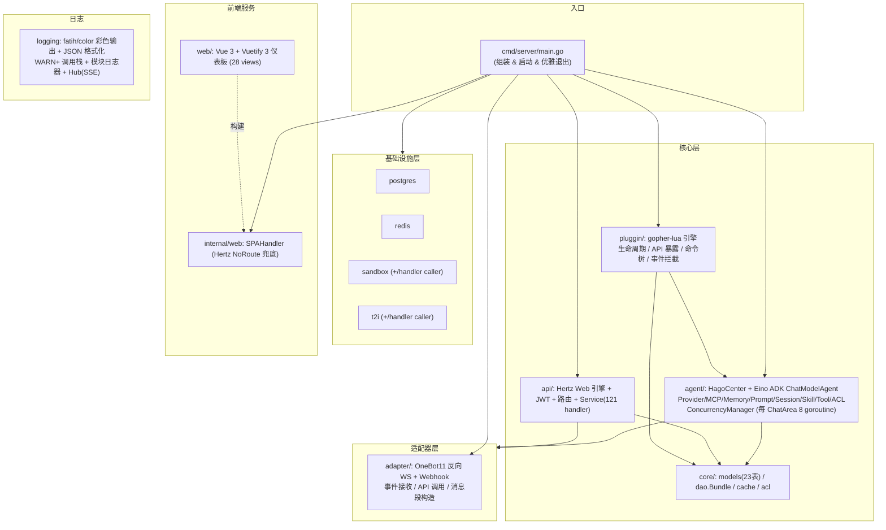

## 模块职责

| 模块 | 包路径 | 职责 |
|------|--------|------|
| **入口** | `cmd/server/main.go` | 组装所有模块、启动服务、反向优雅退出（带 15s watchdog） |
| **适配器** | `internal/adapter/` | OneBot11 反向 WS 服务端 + Webhook HTTP 服务端：事件解析、API 封装、消息段构造 |
| **Agent** | `internal/agent/` | Agent 核心：`HagoCenter` 聚合 Provider/MCP/Memory/Prompt/Session/Skill/Tool/ACL + Eino ADK ChatModelAgent (ReAct loop) + ConcurrencyManager (每 ChatArea 8 goroutine)，事件循环、CronJob、回复策略 |
| **核心库** | `internal/core/` | 数据模型 (GORM)、DAO Bundle、Redis 缓存、ACL |
| **Web API** | `internal/api/` | Hertz Web 引擎、JWT 中间件、路由、Service（121 个 handler + 根路径 `/health`） |
| **插件** | `internal/pluggin/` | gopher-lua 引擎：生命周期、Lua API 暴露、命令树、事件拦截 |
| **基础设施** | `infrastructure/` | postgres、redis、sandbox、t2i 客户端（每个含 `handler` 子包，功能选项风格） |
| **前端服务** | `internal/web/` | `SPAHandler` 通过 Hertz `NoRoute` 兜底服务 `web/dist` |
| **日志** | `internal/logging/` | fatih/color 彩色输出 + JSON 格式化 + 调用栈 + Hub(SSE) |

> **术语陷阱**：`internal/adapter.Provider`=OneBot11 反向 WS 适配器；`internal/agent/provider.ProviderGroup`=LLM Provider 组。`pluggin` 是有意拼写（Lua 插件系统），不要改成 `plugin`。`docs/guidance.md` 拼成 `inferstructure` 是错的，真实路径是 `infrastructure/`。

## 数据模型

共 31 个 GORM 表（见 `internal/core/core.go::AutoMigrate`）。

```mermaid
classDiagram
  class AdminUser { +uint ID; string Username; string PasswordHash; string Role }
  class Provider { string ID; ModelType Type; string Endpoint; string Token; string Model; float32 Temperature; bool IsActive }
  class MCPServer { string ID; string ServerURL; JSONMap Headers; int Timeout; JSONSlice ToolFilter; bool IsActive }
  class Skill { string ID; JSONSlice Keywords; string RegexPattern; string PromptRef; JSONSlice ToolRefs; JSONSlice McpRefs; int Priority }
  class ToolConfig { string ID; string Name; JSONMap Parameters; bool IsBuiltin; bool IsActive; bool AdminOnly }
  class Prompt { string ID; PromptType Type; string Content; bool IsSystem; bool IsActive }
  class Onebot11Adapter { uint ID; string Addr; int Port; string Token; JSONSlice AdminQQNumbers; bool Enabled }
  class WebhookConfig { uint ID; string Addr; int Port; string Token; bool Enabled }
  class T2IConfig { uint ID; string BaseURL; int Timeout; bool IsActive }
  class SandboxConfig { uint ID; string BaseURL; string APIKey; int Timeout; bool IsActive }
  class ChatArea { string ID; AreaType AreaType; int64 TargetID }
  class Session { string ID; string Model; int64 TokenUsage; JSONMap MetaData }
  class ShortTermMemory { string ID; int WindowSize; bool AutoCompact }
  class LongTermMemory { string ID; int HotAreaSize; int HotMemoryTTL }
  class LongTermMemoryItem { string ID; string Content; []byte Embedding; JSONMap Metadata }
  class ChatRecord { int64 ID; int64 UserID; string Role; string Content; int TokenCount; JSONMap ToolCalls }
  class ACLRule { int64 ID; ACLScope Scope; ACLPermission Permission; ACLTargetType TargetType; JSONSlice UserIDs }
  class CronJob { string ID; string CronExpr; string Message; string MessageType; int64 TargetID; bool IsActive; time Time LastRunAt }
  class ReplyStrategyConfig { string ID; string BotName; bool StripMarkdown; bool AgentLite; int QuietGapSeconds; int ForceCount; int MaxAgeSeconds; int WindowMaxMsgs; int JitterSeconds; int ForceCountJitter; float64 ParticipateProbability; int TypingDelayMaxMs }
  class Plugin { string ID; string Name; string Version; string Path; JSONMap Config; bool IsActive }
  class SkillMemory { string ID; string Content }
  class KnowledgeItem { string ID; string Title; string Content; JSONSlice Keywords; string KeywordStatus }

  ChatArea "1" --|> "1" Session
  ChatArea "1" --|> "1" ShortTermMemory
  ChatArea "1" --|> "1" LongTermMemory
  LongTermMemory "1" --|> "N" LongTermMemoryItem
  ChatArea "1" --|> "N" ChatRecord
  ChatArea "1" --|> "N" ACLRule : "按 scope 分组"
```

### 关键模型语义

- **`ChatArea`**：私聊/群聊最小隔离单元，是 Session / Memory / ChatRecord / ACLRule 的父级。由首条消息自动 `GetOrCreate` 创建，无手动创建接口。
- **`ChatRecord`**：`id` 为自增 int64（其他模型多为 UUID）。`Session.AppendRecord` 写 Postgres 与短期记忆 Redis 写入**解耦**——前者为审计/检索，后者为 Agent 上下文窗口。
- **单行配置**：`Onebot11Adapter`/`WebhookConfig`/`T2IConfig`/`SandboxConfig` 固定 `id=1`，首次访问 DB 不存在时 `InitConfig` 用 `OnConflict DoNothing` 创建默认行。
- **`ReplyStrategyConfig`**：无 `DeletedAt` 的单例，参与窗口参数：`quiet_gap_seconds=5, force_count=5, max_age_seconds=20, window_max_msgs=20, jitter_seconds=2, force_count_jitter=1, participate_probability=0.8, typing_delay_max_ms=1500`；旧 `strategy`/`relevance_*` 字段已移除（DB 旧列残留无害）。
- **Prompt `IsSystem`**：启动时 `EnsureSystemPrompt` 幂等播种 `__system_locked__`，强制拼接（顺序 SystemLocked → system → personality → custom）。
- **Plugin `Manifest.System`**：系统插件三层守卫（Manifest.System + `PluginEngine.IsSystem()` + Service 层 Toggle/Delete）禁删/禁停。
- **`CronJob`**：不与 ChatArea 建外键；触发时由 `cronjob.Manager` 构造合成 `adapter.Event{PostType:"cronjob", IsCronJob:true}` 经 `CronJobEvents` channel 注入事件循环。
- **`SkillMemory`**：全局技能记忆单例（`id="global"`），存储从对话中提取的技能/知识/黑话。Compact 时由 LLM 自动更新，写回 Postgres。
- **`KnowledgeItem`**：SQL 知识库条目，存入时由 Agent 异步提取 `Keywords`（`keyword_status`: pending→ready/failed）；对话前 `buildKnowledgeContext` 按关键词命中 + 内容 ILIKE 匹配，命中结果注入系统提示词（LRU 50 条缓存）。

## 状态管理

- **持久化状态** → Postgres（23 张表）
- **缓存状态** → Redis（短期记忆滑动窗口 `shortterm:msgs:<areaID>`、PubSub 任务结果通知、插件/Agent 任意 KV/Hash）
- **插件数据隔离** → Cache 键以 `pluggin:<name>:` 前缀命名空间隔离（注意：`database.query` 当前未真正应用前缀，是 `prefixSQL` 桩）
- **例外** → Lua 插件配置由 `data/pluggins/<name>/pluggin.yaml` 管理（非 DB，便于 bind-mount 跨镜像保留）
- **可插拔服务** → T2I / Sandbox 未配置时自动返回未启用提示；启用时由 API 层 `OnUpdateT2I`/`OnUpdateSandbox` 回调热注入 HagoCenter 与 Service 共享的 `*Client` 指针
- **原则** → 内存中有状态模块（Agent / Memory / Skill）最终与 DB 同步；**不引入纯内存状态**

## HagoCenter 运行时拓扑

`HagoCenter`（`internal/agent/agent.go`）是 Agent 运行时聚合体。`Start` 后并发起 2 个 goroutine：

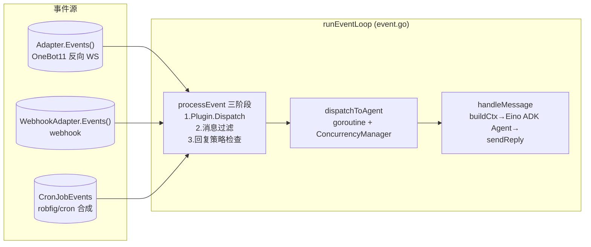

- **`EinoAgent`**（`adk.ChatModelAgent`）：基于 Eino ADK 框架的 ChatModelAgent，工具调用在 ReAct 循环内同步执行，MaxIterations=20。
- **`ConcurrencyManager`**（`concurrency.go`）：每 ChatArea 并发控制（默认 8 goroutine），使用 buffered channel 作为信号量，超限消息排队等待。
- **`CronJobManager`**（`cronjob/cronjob.go`）：`robfig/cron` 调度（秒级），命中后构造合成事件。
- **事件循环 4 个 select 分支**：`ctx.Done` / `Adapter.Events`（断流自愈）/ `webhookEvents` / `CronJobEvents`。

## Agent 子包

| 子包 | 实现 | 说明 |
|------|------|------|
| `provider` | `provider.go` | OpenAI 兼容 `/v1/chat/completions`（流式 SSE）、`Vision`（inline base64）；`ProviderGroup` 同类型单 Active 管理 |
| `mcp` | `mcp.go` | `mark3labs/mcp-go` SSE 客户端；`MCPGroup` 聚合连接 + `ListTools`/`CallTool`（MCP 可覆盖 builtin 同名工具） |
| `memory` | `memory.go` + `shortterm`/`longterm`/`skillmem` | 四层记忆：短期(Redis 滑窗, 默认100条, 自动Compact) / 长期(Postgres + 内存 LRU HotArea + **语义召回**：消息 gram 走 pg_trgm GIN 倒排候选 + similarity 排序，空候选回退最近；`LTM_RECALL_MODE=recent` 可回退旧行为) / 技能记忆(SkillMemory, Compact 时 LLM 自动提取) / 会话记录(Postgres 审计) |
| `prompt` | `prompt.go` | `PromptManager` + 系统锁定提示词 `EnsureSystemPrompt` 幂等播种 + `BuildFullContext`（工具感知不拼入提示词，由 Eino tools 参数提供） |
| `session` | `session.go` | `SessionManager`：`GetOrCreate` / `AppendRecord`(Postgres) / `UpdateTokenUsage` |
| `skill` | `skill.go` | `SkillEngine.Match(input)` 按关键词 / 正则 / priority 匹配首个激活技能 |
| `tool` | `tool.go` / `builtin.go` | `ToolRegistry` + 内置工具 `RegisterBuiltinTools`（OneBot11 / 沙箱 / T2I / vision 等），工具注册为 Eino ADK ToolNode |
| `cronjob` | `manager.go` | `robfig/cron` 调度 + 合成事件 |

## 插件 API 分组（速查）

| 权限 | 全局表 / SDK 字段 | 函数 | 说明 |
|------|--------|--------|------|
| 始终 | `log` (`jn.log`) | 3 | info/warn/error → slog |
| 始终 | `json` (`jn.json`) | 2 | encode/decode |
| `onebot11` | `onebot11` (`jn.onebot11`) | 25 | 消息发送（异步/同步）+ 合并转发 + 引用回复 + 群管理 + 信息查询 + 请求处理 + 登录/状态/版本 + read_file_base64 |
| `http` | `http` (`jn.http`) | 4 | get/post（30s 超时）+ get_async/post_async（异步回调 `on_http_response`） |
| `database` | `database` (`jn.database`) | 2 | query/exec（共享 DB，前缀桩未生效，⚠ 权限敏感） |
| `cache` | `cache` (`jn.cache`) | 4 | get/set/del/exists（`pluggin:<name>:` 命名空间） |
| `t2i` | `t2i` (`jn.t2i`) | 7 | generate/generate_url + generate_async/generate_url_async（异步回调 `on_t2i_response`）+ toggle/is_active/get_config |
| `sandbox` | `sandbox` (`jn.sandbox`) | 11 | create/exec_shell/exec_python + create_async/exec_shell_async/exec_python_async（异步回调 `on_sandbox_response`）+ toggle/is_active/get_config/list/delete |
| `rag` | `rag` (`jn.rag`) | 4 | add/add_async/search/search_async（异步回调 `on_rag_response`） |
| `agent` | `agent` (`jn.agent`) | 17 | 配置查询 + Provider/MCP/Tool 切换 + switch_provider + compact_memory + get_current_chat_area |
| 内置 | `jn.command` | 1 | `register(path, handler, opts)` 多级命令注册 |

详见 [plugin-development.md](plugin-development.md)。

## 前端 SPA 静态服务

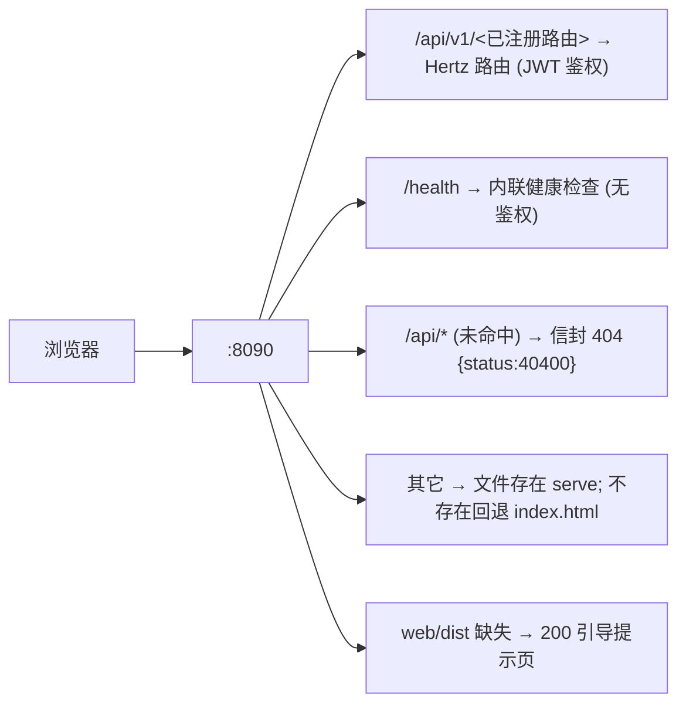

实现：`internal/web/web.go::SPAHandler`（`filepath.Rel` 路径穿越防护）；在 `internal/api/engine/engine.go` 通过 `h.NoRoute(...)` 注册。**不嵌入二进制**（`web/dist` 是磁盘文件，便于只换前端不重编 Go）。开发期 Vite `:3000` 代理 `/api`→`:8090`，Go fallback 不触发。

---

# 二、调用栈

> 调用栈图保留 ASCII 文本风格（开发者熟悉栈格式，mermaid 不便表达调用层）。

## 启动流程

```
cmd/server/main.go:41 main()
├─ flag.Parse + loadDevConfig(dev.yaml)       main.go:49-52     ← 开发配置加载
├─ logging.Init(Config{Debug,Output,Hub})     main.go:63        ← 自定义彩色日志初始化
├─ slog.SetDefault(slog.New(Handler))         main.go:75        ← slog 桥接（旧调用自动走新系统）
├─ postgres.NewPostgresClient(WithHost...)     main.go:98        ← infrastructure/postgres/client.go
├─ redis.NewRedisSentinelClient(WithAddr...)   main.go:111       ← infrastructure/redis/client.go (实为单节点)
├─ core.Init(ctx,db,redis)                     main.go:122       ← internal/core/core.go
│   ├─ AutoMigrate(db)                         core.go:23        ← 注册 31 张表
│   ├─ cache.NewCache(redisClient, $REDIS_PREFIX) core.go:97     ← "juan:" 前缀
│   ├─ dao.NewBundle(db)                        core.go:105      ← internal/core/dao/dao.go (28 个 DAO)
│   ├─ acl.NewACL(bundle.ACL)                  core.go:110      ← internal/core/acl/acl.go
│   └─ InitAdminUser(ctx, UserDAO)             core.go:113      ← core.go (无 admin 时建 admin/Admin123 bcrypt)
├─ middleware.JWTSecret = []byte($JWT_SECRET)  main.go:129-131
├─ loadAdapterConfig(ctx, DAO)                 main.go:133      ← (DB 加载，回退 env)
├─ adapter.New(cfg) + Start(ctx)               main.go:134-142  ← internal/adapter/adapter.go
├─ loadWebhookConfig / NewWebhookAdapter / Start main.go:146-162 ← internal/adapter/webhook.go
├─ agent.NewHagoCenter() / Init / Start         main.go:166-185  ← internal/agent/agent.go (含 Eino ADK buildEinoAgent)
├─ pluggin.NewPluginEngine("data/pluggins",...) main.go:189     ← internal/pluggin/pluggin.go
│   └─ pluginEngine.LoadAll()                   main.go:199     ← (ensureEmbeddedAssets + 逐目录 Load)
├─ service.New(...); 注入 ProviderGroup/MCP/... main.go:216-230 ← internal/api/service/root.go
├─ loadT2IFromDB / loadSandboxFromDB            main.go:226-227  ← (DB 配置 → t2i/sandbox.NewClient)
├─ svc.OnUpdateT2I/OnUpdateSandbox 回调         main.go:228-229  ← 热注入 HagoCenter.T2IClient/SandboxClient
├─ web.EnsureDir($WEB_DIR)                      main.go:237      ← internal/web/web.go
├─ engine.New(addr, webDir, svc)               main.go:241      ← internal/api/engine/engine.go (h.NoRoute=SPAHandler)
└─ go webEngine.Run() / wait ctx                main.go:248-263
```

## 优雅退出（`cmd/server/main.go:287 shutdown`）

```
shutdown(adapterProv, webhookAdapter, hago, webEngine, pluginEngine)  main.go:287
├─ hago.Stop()                                    main.go:289   ← agent.go (占位, 仅打日志)
├─ webhookAdapter.Stop(ctx 5s)                    main.go:290   ← webhook.go (3s graceful)
├─ adapterProv.Stop(ctx 5s)                      main.go:297   ← adapter.go (close events，置 nil 以便重启)
├─ webEngine.Shutdown(ctx 5s)                     main.go:304   ← 先停 adapter 避免锁竞争
└─ (pluginEngine: 占位)                           main.go:310
外层 watchdog：15s 超时强退                       main.go:267-279
```

## OneBot11 反向 WS 事件接收到解析

```
ws_conn ──HTTP upgrade──▶ adapter/server.go:190 handleWS
├─ checkAuth(r)                                 server.go:327   (Bearer token 或 ?access_token=)
├─ websocket.AcceptServer
├─ 读握手 {self_id}, register conns[self_id]     server.go:207-228 (新连入会顶掉旧同 self_id)
└─ readLoop                                      server.go:234
    ├─ echo 字段 → responses[echo] chan          server.go:242  (API 调用响应)
    ├─ heartbeat → drop                          server.go:252
    └─ parseEvent(json)                          server.go:287
        └─ 根据 PostType 反序列化子事件 → s.events <- ev (非阻塞, drop-on-full)
                                                    server.go:278-282
```

触发链路：`Adapter.events` ← `wsServer.events` ← `readLoop`。事件入口 `Adapter.Events()` (`adapter.go:124`)。

## OneBot11 API 调用（Agent 工具 / 插件 → WS）

```
Adapter.SendPrivateMsg(uid, msg)                 api.go:15
└─ call("send_msg", {user_type:"private",...})   api.go:208
   └─ server.callAPI(action, params)             server.go:138
      ├─ conn = selfID() 取首连                   server.go:139
      ├─ echo = atomic.AddUint64(&seq)
      ├─ responses[echo] = make(chan *APIResponse, 1)
      ├─ conn.WriteJSON(APIRequest{Action,Params,Echo})
      └─ select { ch → parse; 10s timeout; <-ctx }
```

`normalizeMessage`（`api.go:324`）兼容 string / `Segment` / `[]Segment` / `*MessageBuilder`，含 CQ 码时重新解析。

## Agent 事件循环（核心路径）

```
runEventLoop                                     agent/event.go:39
└─ select {
   case <-ctx.Done(): stop
   case ev := <-h.Adapter.Events():              event.go:50
       若 channel 关闭(适配器重启): sleep 1s 重新取 Events() (event.go:52)
       ev.Admins = h.Adapter.Admins()
       h.processEvent(ctx, ev)
   case ev := <-webhookEvents:                   event.go:63 (WebhookAdapter != nil 时)
       h.processEvent(ctx, ev)
   case ev := <-h.CronJobEvents:                  event.go:69
       ev.Admins = h.Adapter.Admins()
       h.processEvent(ctx, ev)
   }
```

### processEvent（三阶段架构）

```
processEvent 三阶段                                  event.go:81
├─ Phase 1: PluginEngine.Dispatch(ev)                event.go:83-89
│   result.Consumed=true → return (插件拦截，不入 Agent)
│   ev = result.Event (插件可修改事件)
├─ Phase 2: 仅 message 事件继续                     event.go:90-92
│   PostType!="message" || Message==nil → return
├─ Phase 3: 参与窗口派发                              event.go
│   dispatchToAgent：@/命令/提及名字/私聊 → mustKeep 立即回（丢弃当前窗口）
│   噪音消息（剥离 CQ 码/URL 后无任何文字，如纯图/纯 sticker）→ 规则丢弃
│   其余候选 → enqueueParticipation 攒窗（trailing 安静定时器 + 计数/最迟强发）
└─ releaseWindow → runAgent(ctx, events, chatArea, rs)
    goroutine + ConcurrencyManager.Acquire(chatAreaID)
    → handleMessage（整窗一次） → ConcurrencyManager.Release(chatAreaID)
```

### handleMessage（Eino ADK 对话主流程）

```
handleMessage                                       event.go:311
├─ msg = 批次最后一条; chatArea 缺失时 getChatArea   event.go:315-324
├─ 聊天黑名单: isAdmin || ACL.CheckChat → 丢弃       event.go:327-341
│   (命中黑名单直接丢弃, 不进入 Agent, 不写回 tool msg)
├─ h.Session.GetOrCreate(chatArea.ID)               event.go:344
├─ 收集批内用户消息(带发言人标识) + Skills.Match      event.go:351-380
├─ Loops.Register 活跃循环 (Web 监控页展示)         event.go:388-397
├─ longTermMems = h.Memory.RecallLongTermMemory    event.go:402
│   (语义召回: 消息 gram → pg_trgm 倒排候选 + similarity 排序; 空候选回退最近 5 条)
├─ skillMem = h.Memory.GetSkillMemory()              event.go:413
├─ systemCtx = h.Prompt.BuildFullContext(longTermMem, skillMem)
│   (工具感知不拼入提示词, 由 Eino 每次模型调用自动携带 tools 参数)
├─ buildKnowledgeContext(批内消息): LRU/DB 模糊匹配知识库, 命中拼入 systemCtx
│   (关键词命中 + 内容 ILIKE 兜底, 限 5 条, LRU 50 条缓存)
│                                                   event.go:415
├─ buildStickerContext: 表情包全部标签 + 「常用」标签下的表情(ID/描述) 拼入指令
│   (Agent 优先按标签取表情 / 直接用常用表情 ID 发 send_sticker)          event.go:sticker.go
├─ einoMsgs 组装: system → sessionCtx → [Skill:] → 短期记忆 → user
│                                                   event.go:418-437
├─ AddShortTermMessage + Session.AppendRecord (Postgres 解耦)
│                                                   event.go:440-447
├─ 读 ReplyStrategy: skipSilenceCheck / agentLite    event.go:450-465
│   + WithMsgSessionCtx + DeferredSendQueue 入队       event.go:468-483
├─ adk.NewRunner(ctx).Run(ctx, einoMsgs)             event.go:491-520
│   Eino ADK ReAct 循环（工具调用同步完成, 累计每轮 token）
├─ 任务期间排队的发送消息 deferredSends.Flush 统一发送
│                                                   event.go:545
├─ 非空内容且未投递当前会话:
│   群聊检查 isSilenceResponse("__NO_REPLY__" 或静默短语) → drop
│   sendReply + recordChat("assistant",...) + Memory.AddShortTermMessage
│                                                   event.go:571-584
└─ Session.RecordTokenUsage (会话总账 + 每日统计)    event.go:526-530
```

### 工具调用（Eino ADK ReAct 循环内同步执行）

工具调用完全由 Eino ADK ChatModelAgent 的 ReAct 循环管理，所有工具同步执行：

```
Eino ADK ReAct 循环 (MaxIterations=20)
└─ for each iteration:
   ├─ LLM.Chat(messages, tools) → resp
   ├─ resp 无 ToolCalls → 返回文本回复，循环结束
   └─ resp 有 ToolCalls:
      ├─ 工具来源: buildEinoAgent 时合并的 Eino 工具列表
      │   (builtin 在前 + MCP 追加在后, 见 tool/eino_tool.go::BuildEinoTools)
      ├─ 由 JuanNiangMiddleware.WrapInvokableToolCall 包装后同步执行
      │   (记录日志 + 更新 LoopTracker 当前工具 + 仅管理员工具校验)
      ├─ 执行结果回填 tool-role msg → 继续下一轮 ReAct 迭代
      └─ 权限: ACL 仅聊天黑名单(handleMessage 阶段); 标记 admin_only 的工具
         (ToolConfig 表, Tools 页可逐工具开关)在 WrapInvokableToolCall 强制校验
         调用者为 Admins 列表内, 否则拒绝执行(防提示词注入); 内置群管理工具
         首次启动 seed 默认开启
```

> **已移除**：BgTaskExecutor 和 DrainerAgent 已完全移除。所有工具调用（包括长时间运行的操作）均在 Eino ADK 的 ReAct 循环内同步完成。

## CronJob 调度

```
CronJobManager.Run                                 cronjob/manager.go:46
├─ reloadAll: ListActive → cron.AddFunc(expr, makeJobFunc(job))
│   makeJobFunc(job):
│     触发时 DAO.CronJob.UpdateLastRun(now)
│     构造 adapter.Event{PostType:"cronjob", IsCronJob:true,
│       CronJobPayload, CronJobPluginIDs, Time:now}
│     可选 Message: 由 job.Message/MessageType/TargetID 组装
│       (仅作为插件 on_cronjob 的 raw_message 等上下文, 不进 LLM)
│     非阻塞 send to eventChan (= HagoCenter.CronJobEvents)
│     manager.go:98-136
├─ cron.Start()
└─ <-ctx → cron.Stop()

API 侧变更: AddCronJob/UpdateCronJob/DeleteCronJob/ToggleCronJob
   → svc.CronJobManager.Reload() 同步调度器      service.go:1733/1768/1808/1822
```

## Web API 请求 → handler

```
Hertz server (engine.go:18)
└─ middleware.Recovery → middleware.CORS → router.RegisterRoutes
   └─ /api/v1 组: 中间件 JWTAuth? (各路由按需)
      └─ svc.<Handler> (121 个, 内部走 DTO transfer + DAO)
        成功 → dto.GenFinalResponse(OK, data) → 200
        失败 → GenFinalResponse(<错误码>, nil) → 200
未命中路由:
   /api/* → web.SPAHandler: 即 404 信封 {status:40400,info:"资源不存在"}
   其它   → serve 文件 / 回退 index.html / 引导页
```

## 日志系统（自定义彩色日志）

基于 `github.com/fatih/color` 的自定义日志系统，替代 `log/slog`。功能：彩色输出、JSON 自动格式化、WARN+ 调用栈、模块日志器、GORM SQL 日志集成。

```
log.Info("msg", k, v)  → Logger.log()              logging/logger.go:182
├─ kvsToMap(kvs) → attrs map
├─ level >= WARN → captureStack(skip) 捕获调用栈
├─ Entry{Time, Level, Module, Message, Attrs, Stack}
├─ writeStdio(entry, level)                          logging/logger.go:251
│   彩色输出: 时间戳(灰) + 级别(绿/黄/红) + 模块名(蓝)
│   + 消息(JSON 自动格式化着 cyan 色) + 元数据(key=白 bold)
│   + 调用栈(WARN+ 级别, 红)
└─ hub.Push(entry)                                   logging/hub.go:41
    环形 buffer[250] 写入 + 副本遍历 subscribers 非阻塞发送

slog 兼容: Handler 桥接器将 slog 调用路由到新系统 (logging/handler.go)
GORM 集成: GormLogger 将 SQL 日志路由到 logging 模块 (infrastructure/postgres/gorm_logger.go)

GET /api/v1/logs/stream → svc.StreamLogs          service.go:1634
├─ sse.NewWriter(c)
├─ 阶段1: LogHub.Recent() 250 条按序 WriteEvent("log")
├─ 阶段2: subscribe() 实时 WriteEvent("log", entry)
└─ 每 15s WriteKeepAlive 心跳（兼测死连）
```

---

# 三、EventLoop 与事件流

## 事件来源

JuanNiang-Neo 有三类外部事件源，最终都汇入 `HagoCenter.runEventLoop`（`internal/agent/event.go:38`）：

| 来源 | 通道 | PostType | 备注 |
|------|------|----------|------|
| OneBot11 反向 WS | `h.Adapter.Events()` | `message`/`notice`/`request`/`meta_event` | 由 `internal/adapter/server.go::readLoop` 推送 |
| Webhook | `h.WebhookAdapter.Events()` (`webhookEvents`) | `webhook` | 由 `internal/adapter/webhook.go::handleRequest` 推送；外部 HTTP POST 触发 |
| CronJob | `h.CronJobEvents` | `cronjob` | 由 `agent/cronjob/manager.go::makeJobFunc` 合成 |

## EventLoop（2 个 goroutine）

`HagoCenter.Start` 启动两个并发 goroutine（`agent.go:334-339`）：

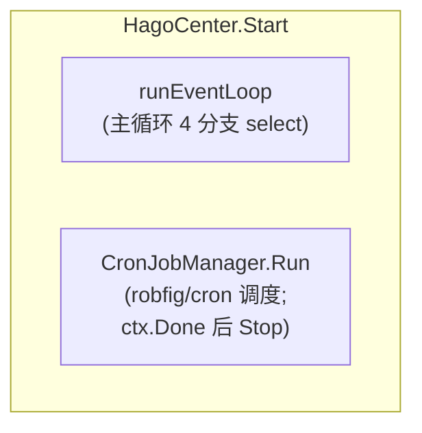

`runEventLoop` 的 4 个 select 分支（`event.go:38-77`）：

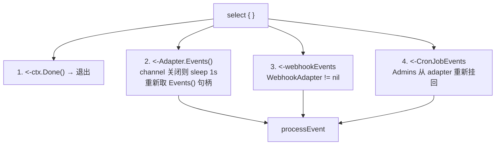

1. `<-ctx.Done()` → 直接退出循环
2. `<-h.Adapter.Events()`：OneBot11 事件。若 channel 关闭（适配器 `Stop` 调用了 `close(events)`），不会 panic——记日志、sleep 1s 重新获取 `Events()` 句柄并 continue（`event.go:52`）。这正是反向 WS 重启后事件循环自愈的关键。
3. `<-webhookEvents`（仅 `WebhookAdapter != nil`）：调用 `processEvent`。
4. `<-h.CronJobEvents`：合成 cronjob 事件，`Admins` 从 adapter 重新挂回后喂 `processEvent`。

## 事件分发决策树（processEvent 三阶段）

`processEvent`（`event.go:81-117`）采用三阶段架构：Plugin 拦截 → 消息过滤 → 回复策略检查 → 异步派发 Agent。

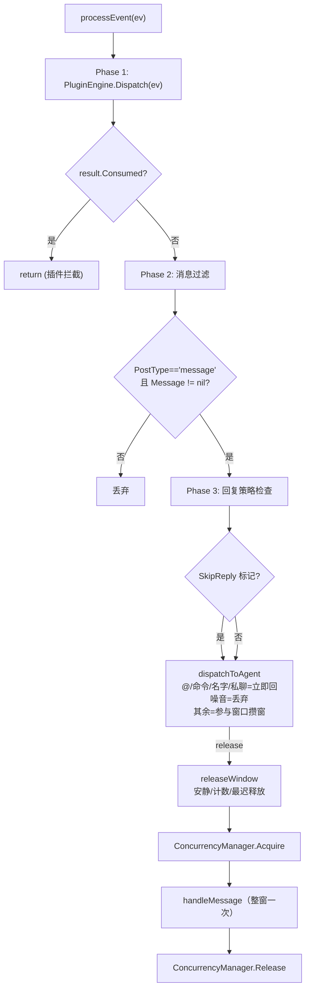

> `isAtSelf`（`reply_strategy.go`）做的是精确 `[CQ:at,qq=<self>]` 匹配；优先用当前 `Adapter.SelfID()` 而非缓存 `SelfQQ`，支持机器人换号后立即生效。
> 参与窗口（`dispatchToAgent` → `enqueueParticipation` → `releaseWindow`）：@/命令/提及名字/私聊 → mustKeep 立即回（跳过相关性判断，但仍进 Agent 调用 LLM 生成回复）；噪音消息（剥离 CQ 码/URL 后无任何文字，如纯图/纯 sticker/表情）→ 规则丢弃；其余候选（含 @、剥离 CQ 码/URL 后仍含文字的消息）攒进每群一个窗口；≤2 字短消息与纯 emoji/符号判为噪音丢弃——trailing 安静定时器（来消息即重置，间隔带 `jitter_seconds` 随机抖动）→ 安静释放；或攒够 `force_count`（+`force_count_jitter` 上偏，采样 ∈ [0, force_count_jitter]）条 / 到达 `max_age_seconds` 最迟必发 → 强制释放（不参与概率，保证"攒的话必说"）。释放时整窗一次喂给 Agent，由 LLM 自门控（`__NO_REPLY__`）决定参与/静默；安静释放受 `participate_probability` 约束（1-p 静默放弃本窗）；参与路径发送前可加 `typing_delay_max_ms` 随机"打字延迟"。窗口消息数超 `window_max_msgs` 丢最旧保最新。

## 一条消息的全程（OneBot11 → 回执）

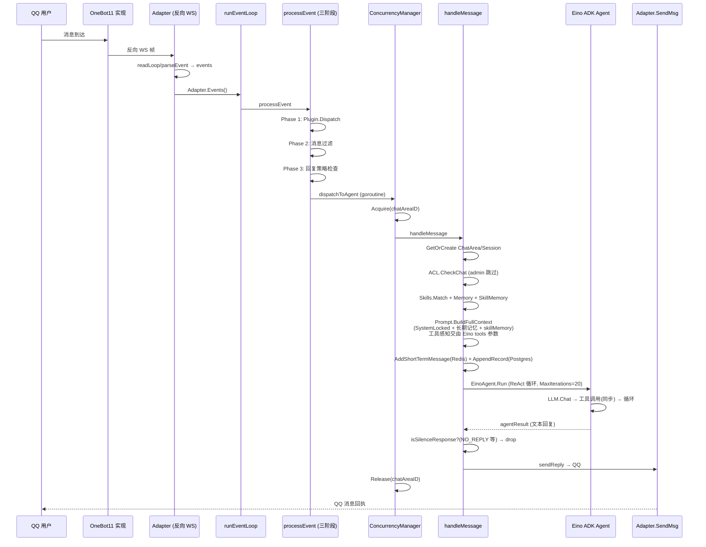

## CronJob 注入流

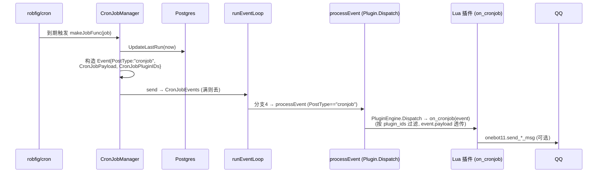

> CronJob 事件只派发给 Lua 插件（`on_cronjob` 回调），**不进入 LLM Agent**、不经过回复策略与 ACL。CronJob 的 `message`/`message_type`/`target_id` 字段仅作为 `event.raw_message` 等上下文透传给插件。

API 侧增删改后 `Manager.Reload()` 同步调度器（`service.go:1733/1768/1808/1822`），无需重启进程。详见 [webhook-cronjob.md](webhook-cronjob.md)。

## Webhook 注入流

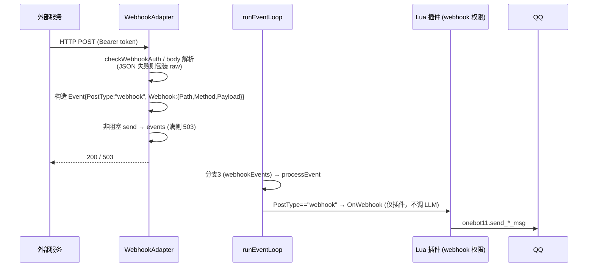

> Webhook 不走 Agent LLM 路径，是对外暴露给 Lua 插件的事件钩子（如 GitHub push 通知触发群发）。详见 [webhook-cronjob.md](webhook-cronjob.md)。

## 关键不变量

- **Adapter 重启不会击穿事件循环**：`Adapter.Stop` 会 `close(events)` 并置 nil，`Start` 时若 `events==nil` 重建（`adapter.go:36-62`）；EventLoop 分支2 检测关闭后 sleep 1s 重新取句柄（`event.go:52`）。
- **Redis 与 Postgres 解耦**：短期记忆写 Redis 是为了 LLM 上下文窗口，`Session.AppendRecord` 写 Postgres 是为了审计检索；任一失败不影响另一路。
- **黑名单不豁免管理员**：ACL 聊天黑名单对所有用户生效（含 Admins 列表，即 `Onebot11Adapter.AdminQQNumbers`）；`handleMessage` 中仅 `ACL.CheckChat(...)` 决定消息是否进入 Agent（旧 `isAdmin ||` 豁免已移除）。ACL 现仅管理聊天黑名单（仅 `deny` 规则生效，`allow` 规则不再生效）；黑名单外管理员的 admin_only 工具权限校验不受影响。
- **`__NO_REPLY__` 静默**：LLM 可主动输出 `__NO_REPLY__` 让系统不发任何 QQ 消息（避免群聊噪音）。
- **SystemLocked 强制拼接**：每次对话系统提示词必含 `__system_locked__` 内容，前端不能停用，保证 LLM 知道能用 T2I 富文本、分消息段、权限层级等行为约束。
- **工具调用全同步**：所有工具调用（包括长时间运行的操作）均在 Eino ADK ReAct 循环内同步完成，无后台任务分流。BgTaskExecutor 和 DrainerAgent 已完全移除。
- **每 ChatArea 并发控制**：`ConcurrencyManager` 通过 buffered channel 信号量控制每个 ChatArea 最多 8 个 Agent goroutine 并发（默认值可配置），超限消息排队等待。

---

# 四、插件系统

## 概述

JuanNiang-Neo 的 Lua 插件系统基于 `gopher-lua`（Go-Lua 绑定），允许用户通过 Lua 脚本扩展机器人功能。插件可以：

- 拦截 OneBot11 消息事件 / Webhook 事件
- 注册多级斜杠命令（如 `/system provider switch`）
- 调用 OneBot11 协议接口、HTTP、数据库、Redis 缓存、T2I、Sandbox、Agent 操作接口
- 通过内嵌 Lua SDK（`jn.lua`，带 LuaCATS 注解）获得 IDE 类型提示

> **拼写约定**：`pluggin`（双 g 单 n）是**有意**拼写：模块路径 `internal/pluggin`、配置文件 `pluggin.yaml`、插件目录 `data/pluggins`。请勿"修正"为 `plugin`。开发完整指南见 [plugin-development.md](plugin-development.md)。

## 组件结构

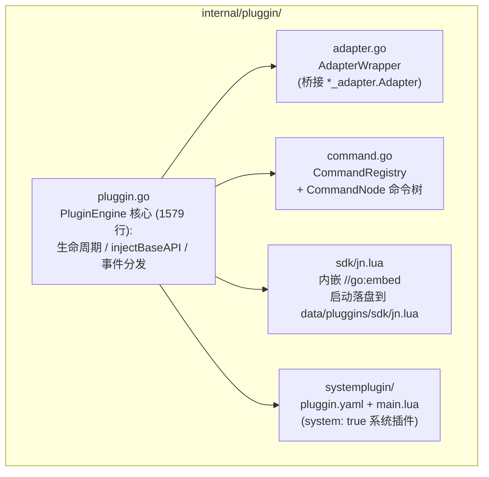

## 生命周期

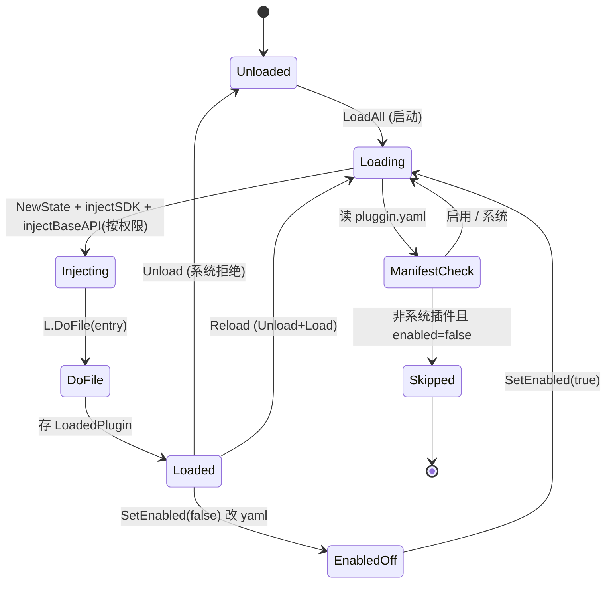

代码位置：

```
LoadAll (启动调用)                              pluggin.go:207
    ├─ ensureEmbeddedAssets: 写 sdk/jn.lua + system/{pluggin.yaml,main.lua}
    │   每次 startup 强制覆盖 (保证镜像升级后插件一致)         pluggin.go:1554
    ├─ 读 basePath (默认 "data/pluggins") 目录
    ├─ 跳过 sdk/ 子目录
    ├─ 逐插件目录: 读取 manifest
    │     非系统插件且 Enabled==false → 跳过 (不加载)
    │     Load(name)                           pluggin.go:239
    └─ (任一插件加载失败仅 slog.Error, 不阻塞其他)

Load(name)                                       pluggin.go:239
    ├─ mutex 持锁; 拒绝重复加载
    ├─ 读 manifest (pluggin.yaml)
    ├─ PPID 为空 → 生成 UUID 并写回 pluggin.yaml          pluggin.go:254
    ├─ lua.NewState
    ├─ injectSDK: <basePath>/sdk/?.lua 追加 package.path (require "jn" 可用)
    ├─ injectBaseAPI: 按 permissions 注入全局表 (log/json/onebot11/http/database/cache/t2i/sandbox/agent)
    ├─ injectCommandAPI: 注入 __jn_internal.register_command
    ├─ L.DoFile(<entry> ; 默认 main.lua) → run
    └─ 存 LoadedPlugin

Unload(name)                                     pluggin.go:281
    ├─ 系统插件拒绝 (返回 err)
    ├─ commands.UnregisterPlugin(name) 清理该插件所有命令
    └─ LState.Close()

Reload(name) = Unload + Load                     pluggin.go:301
SetEnabled(name, bool) 重写 pluggin.yaml 的 enabled 字段    pluggin.go:1439
List() / ListMaps() (后者合并 disk 上未加载的插件, 供 Web API)  pluggin.go:308/321
```

系统插件三层守卫（`Manifest.System` + `PluginEngine.IsSystem()` + Service 层 Toggle/Delete），确保 `system` 插件不可删/停。

## Manifest（`pluggin.yaml`）

| 字段 | 类型 | 说明 |
|------|------|------|
| `ppid` | string | 稳定 UUID（空时自动生成并写回） |
| `name` | string | 插件名（=目录名，作为 `id`） |
| `version` | string | 版本，默认 `"1.0.0"` |
| `author` | string | 作者 |
| `description` | string | 描述 |
| `entry` | string | Lua 入口，默认 `main.lua` |
| `permissions` | string[] | 申请的权限（`onebot11`/`http`/`database`/`cache`/`t2i`/`sandbox`/`agent`） |
| `system` | bool | 系统插件（undeletable / unstoppable） |
| `enabled` | bool | 是否启用（控制是否在 LoadAll 时加载） |

示例（系统插件 `internal/pluggin/systemplugin/pluggin.yaml`）：

```yaml
ppid: 6563c9c3-1072-4168-8bb3-62db4c11990b
name: system
version: "1.0.0"
author: JuanNiang-Neo
description: "系统插件，封装 Agent/Provider/MCP/Tool/T2I/Sandbox/Session 管理命令"
entry: main.lua
system: true
enabled: true
permissions:
  - onebot11
  - agent
  - t2i
  - sandbox
```

## 事件回调

插件通过两个全局 Lua 函数拦截事件（PCall，2 返回值 `(consumed bool, reply string)`）：

| 回调 | 触发 | 权限过滤 |
|------|------|----------|
| `on_message(event)` | 收到 OneBot11 `/` 开头走 commands.Dispatch；否则对每条有 `onebot11` 权限的插件调用 | `onebot11` |
| `on_webhook(event)` | Webhook 事件到达（不走 LLM Agent） | `webhook` |

`EventData` 结构（传给 Lua 的 event table）：

```go
type EventData struct {
    PostType    string
    MessageType string
    UserID      int64
    GroupID     int64
    RawMessage  string
    Admins      []string
    Webhook     map[string]any
}
```

`OnMessage` 决策（`pluggin.go:397-441`）：

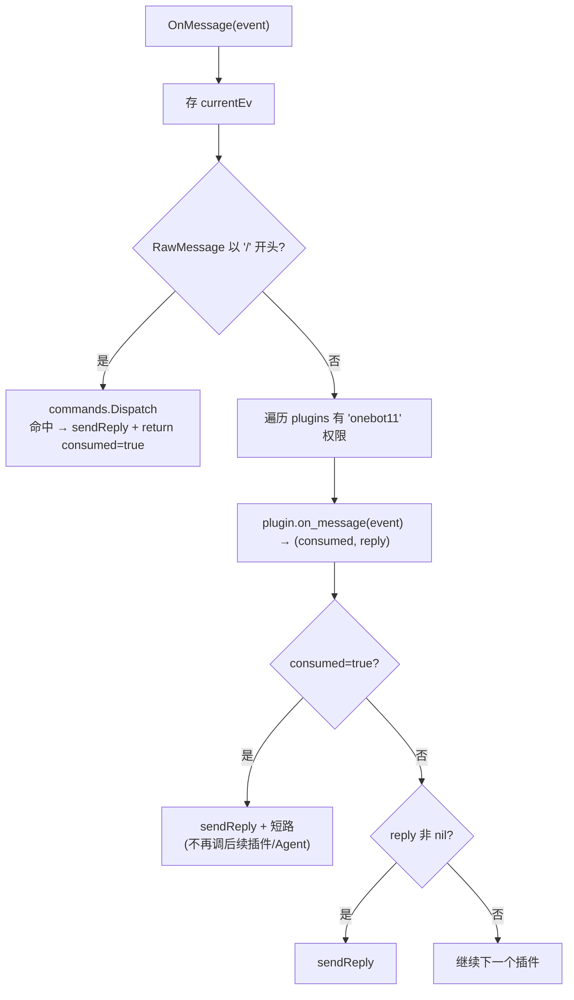

## 命令树（CommandRegistry）

`internal/pluggin/command.go` 实现多级命令派发：

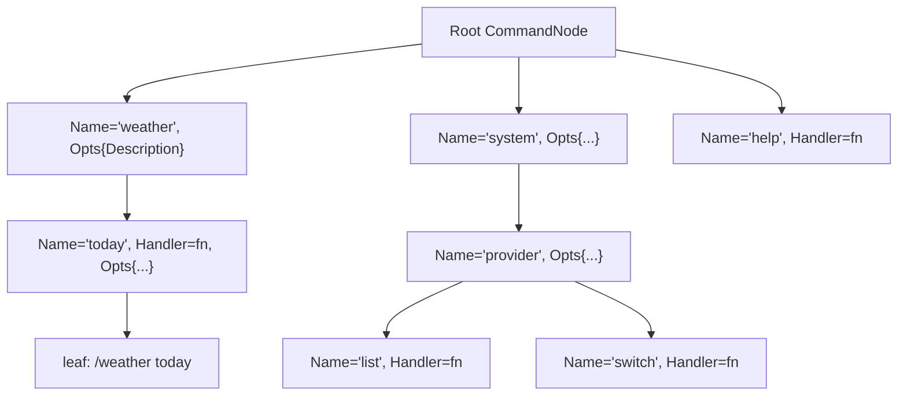

```
CommandNode {Name, Opts{Description,Usage}, Handler, PluginName, Children map}
   长前缀匹配, 最长匹配节点带 Handler 时执行
   未命中 Handler 但停在非 root → 返回该节点子命令列表
   Dispatch(raw, event): 按 "/" 分词遍历, 取最后带 handler 的节点, 调用 handler(剩余 args, event)
```

命令 handler 签名（Go 侧）：

```go
type CommandHandler = func(args []string, event EventData) (consumed bool, reply string, err error)
```

Lua 侧通过 SDK `jn.command.register(path, handlerFn, opts)` 注册，path 可为 string 或 table（多级），handler 接收 `(argsTable, eventTable)` 返回 `(consumedBool, replyString)`。

内置 `/help` 在 `registerBuiltinCommands()` 注册（plugin=`system`），列出所有顶级命令；`/help <cmd> [sub...]` 列出子命令与用法。

插件卸载时 `UnregisterPlugin(name)` 递归清理该插件注册的所有命令并修剪空叶子。

## 注入的 Lua 全局表

按 `permissions` 字段 gated，由 `injectBaseAPI`（`pluggin.go:973`）注入。完整签名见 [plugin-development.md](plugin-development.md#api-参考)。

| 全局表 | 权限 | 说明 |
|--------|------|------|
| `log` | 始终 | info/warn/error → slog `[plugin:<name>]` 前缀 |
| `json` | 始终 | encode/decode |
| `onebot11` | `onebot11` | 25 个 OneBot11 API（SendAdapter 接口桥接；含合并转发/引用回复） |
| `http` | `http` | get/post/get_async/post_async，30s 超时；可选 proxy（http/socks4/socks4a/socks5） |
| `database` | `database` | query/exec（共享 DB；`prefixSQL` 桩未生效，⚠ 任意 SQL） |
| `cache` | `cache` | get/set/del/exists（`pluggin:<name>:` 前缀命名空间） |
| `t2i` | `t2i` | generate / generate_url + toggle/is_active/get_config |
| `sandbox` | `sandbox` | create/exec_shell/exec_python/list/delete + toggle/is_active/get_config |
| `agent` | `agent` | 配置查询 + Provider/MCP/Tool 切换 + switch_provider + compact_memory |
| `jn.command` | 内置 | 命令注册 |

## Lua SDK（`jn.lua`）

由 Go 二进制内嵌（`//go:embed sdk/jn.lua`，`pluggin.go:1543`），启动时 `ensureEmbeddedAssets` 落盘到 `data/pluggins/sdk/jn.lua`（每次覆盖以匹配二进制版本）。`injectSDK` 把 `<basePath>/sdk/?.lua` 追加到 LState 的 `package.path`，使 `require("jn")` 可用。

SDK 仅捕获 Go 注入的全局表作为模块字段（`jn.log = log` 等），不引入额外行为；带 LuaCATS 注解，sumneko lua-language-server 可提供完整代码提示。

```lua
local jn = require("jn")
jn.log.info("插件启动")
local id, err = jn.t2i.generate("<h1>Hello</h1>")
```

## 数据隔离

- **Cache**：所有 `cache.*` 操作自动加 `pluggin:<name>:` 前缀，插件间键不冲突，且无法读写 Agent 的 `session:`/`shortterm:` 前缀。
- **Database**：`database.query/exec` 跑在**共享库**上，`prefixSQL` 桩当前未应用 `pluggin_<name>_` 前缀；请谨慎授 `database` 权限（⚠ 任意 SQL，可在插件侧加自己的表前缀）。
- **插件配置**：`data/pluggins/<name>/pluggin.yaml` 在磁盘，不进 DB（除非 DB `plugins` 表存元数据镜像）。

## 安全建议

- 仅对受信插件授予 `database` 权限
- 对从社区上传的 ZIP 插件先审阅 Lua 源码再 Deploy
- 系统插件 `system` 提供 `/system provider switch`、`/system memory compact` 等管理命令，需要 admin 操作（受 ACL 与 OneBot11 Adapters 的 Admins 双重保护）